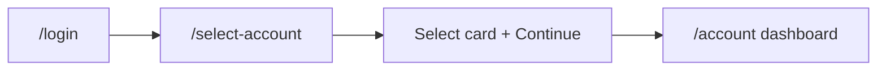

# Account context (post-login `/select-account`)

After login, BizFlex routes users to **[`/select-account`](https://bizflex-app.netlify.app/select-account)** to choose a workspace before the dashboard loads. Automation treats account selection as **setup**, not repeated per-spec UI logic.

## Flow



1. **`npm run auth`** / **`setup` project** — API login → browser storage in `storage/authenticated-user.json` (UI login + account pick using env below).
2. **`chromium` project** — loads canonical storage; specs call **`prepareAuthenticatedPage(page, testInfo, accountOptions?)`** or use **`authenticatedPage`** fixture.
3. **Picker resolution** — `resolveSelectAccountToDashboardIfNeeded` / `selectAccountOnPicker` (never assumes “first card” when multiple accounts exist without env criteria).

## Core APIs

| API | Location | Purpose |
|-----|----------|---------|
| `loginAndSelectAccount(page, options)` | `support/ui/loginAndSelectAccount.ts` | Full UI login + picker + dashboard assert |
| `selectAccountOnPicker(page, options)` | `support/ui/selectAccount.ts` | Picker only (card + Continue) |
| `prepareAuthenticatedPage(page, testInfo, options?)` | `support/ui/prepareAuthenticatedPage.ts` | Seeded session → dashboard |
| `SelectAccountPage` | `pages/SelectAccountPage.ts` | POM for picker |
| `AccountSelectOptions` | `config/accountContext.ts` | `accountType`, `accountName`, `accountId`, `preferLastUsed` |

### Fixtures (`tests/shared/fixtures/account.fixture.ts`)

| Fixture | Behavior |
|---------|----------|
| `authenticatedPage` | Worker storage + env/default `accountContext` |
| `freelancePage` | `E2E_FREELANCE_*` preset |
| `businessPage` | `E2E_BUSINESS_*` preset |
| `freshAccountPage` | Empty storage, full `loginAndSelectAccount` |
| `accountContext` (option) | Per-test override: `test.use({ accountContext: { accountName: '…' } })` |

`tests/shared/fixtures/auth.fixture.ts` re-exports the same `test` / `expect` for backward compatibility.

## Environment variables

### Required (unchanged)

| Variable | Purpose |
|----------|---------|
| `TEST_EMAIL` | Storage generation + default API/UI login |
| `TEST_PASSWORD` | Paired with `TEST_EMAIL` |
| `PLAYWRIGHT_BASE_URL` | SPA origin (e.g. `https://bizflex-app.netlify.app` — **no** `/login` suffix) |
| `API_URL` | API host for auth probe / API tests |

### Account picker (CI secrets / `.env.local`)

| Variable | Purpose |
|----------|---------|
| `E2E_SELECT_ACCOUNT_NAME` | Default card name substring (e.g. `France Spain`) |
| `E2E_SELECT_ACCOUNT_TYPE` | `freelance` / `freelancer` / `business` |
| `E2E_DEFAULT_ACCOUNT_ID` | `data-testid="select-account-option-{id}"` when app provides testids |
| `E2E_PREFER_LAST_USED_ACCOUNT` | `1` to pick LAST USED card when name/type unset |
| `E2E_FREELANCE_ACCOUNT_NAME` | Freelance preset for `freelancePage` / switch tests |
| `E2E_FREELANCE_ACCOUNT_ID` | Optional id + testid |
| `E2E_BUSINESS_ACCOUNT_NAME` | Business preset for `businessPage` |
| `E2E_BUSINESS_ACCOUNT_ID` | Optional id + testid |
| `E2E_BUSINESS_ACCOUNT_NAME_2` | Second business for switch tests |
| `E2E_BUSINESS_ACCOUNT_ID_2` | Second business id |

### Transfer API (separate from UI picker)

| Variable | Purpose |
|----------|---------|
| `TRANSFER_ACCOUNT_ID` | Debiting `accountId` in API payload (must belong to logged-in user) |
| `VALID_USER_EMAIL` / `VALID_USER_PASSWORD` | Preferred API login for transfer specs |

## Storage state

| Path | Gitignored | Notes |
|------|------------|--------|
| `storage/authenticated-user.json` | Yes | Canonical; generated with **env default account** at auth time |
| `storage/authenticated-user-worker-*.json` | Yes | Per-worker clones |
| `storage/authenticated-session-seed.json` | Yes | `sessionStorage` replay |
| `.auth/` | Yes (if used) | Optional profile dir — same rules as `storage/` |

**Do not commit** generated JSON. CI runs `npm run auth` with secrets before tests.

Per-account storage files (e.g. `.auth/freelance.json`) are **not required**; use env + `freelancePage` / `businessPage` or `accountContext` option instead. Add profile-specific `npm run auth` only if you need faster cold starts later.

## Run locally

```bash
# 1. Configure .env.local (see .env.example)
# 2. Refresh storage (picks account using E2E_* at auth time)
npm run auth

# 3. Run suites
npm run test:auth          # includes account-selection.ui.spec.ts
npm run test:smoke
npm run test:regression

# Account selection specs only (ui-login project)
npx playwright test tests/auth/account-selection.ui.spec.ts --project=ui-login
```

## CI/CD

Existing workflows unchanged in structure:

1. Verify `TEST_EMAIL` / `TEST_PASSWORD`
2. `npm run auth` — pass `E2E_SELECT_ACCOUNT_NAME`, `E2E_FREELANCE_*`, `E2E_BUSINESS_*` as repository **secrets** when QA accounts differ per environment
3. Run Playwright matrix lanes

Add repository secrets for account names used in your QA tenant (see table above). Without them, multi-account users fail fast with a clear message instead of clicking the wrong row.

## Test classification

| Category | Examples | Account handling |
|----------|----------|------------------|
| Account-agnostic | Many API specs, login validation | No picker |
| Default dashboard | `dashboard.smoke`, payment-link UI | Env default via storage + `prepareAuthenticatedPage` |
| Freelance-only | (tag when added) | `freelancePage` or `accountContext: { accountType: 'freelance' }` |
| Business-only | Business-specific flows | `businessPage` or explicit name |
| Both contexts | Same assertion, two workspaces | Parameterize or two describes with different fixtures — **do not** duplicate entire suites blindly |

Dedicated coverage: `tests/auth/account-selection.ui.spec.ts` (`@auth`).

## Backend / QA data assumptions

Before UI tests run, the **TEST_EMAIL** user must:

- Complete login successfully
- See at least one account on `/select-account`
- For switch tests: have **both** freelance and business accounts named in env
- For transfer API: `TRANSFER_ACCOUNT_ID` must be an account that user may debit (not PND)

Coordinate with backend when login or account linking changes — refresh storage and update env names.

## App recommendations (stable automation)

Add to each picker row:

- `data-testid="select-account-option-{accountId}"`
- Optional `data-testid="select-account-continue"`

Avoid relying on Chakra `css-*` class names (see SelectorsHub note in QA review).

## Manual follow-up

- [ ] Set CI secrets for `E2E_SELECT_ACCOUNT_NAME` / freelance / business names for your tenant
- [ ] Confirm `/select-account` is reachable when already logged in (for switch tests)
- [ ] Align `TRANSFER_ACCOUNT_ID` with `VALID_USER_EMAIL` wallet in staging
- [ ] Tag business-only / freelance-only specs as you split suites
- [ ] Add in-app account switcher tests when product exposes switch UI (vs `goto('/select-account')`)
