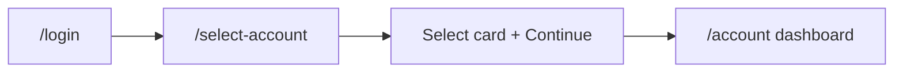

# Account context (post-login `/select-account`)

**Agent handoff:** For full repo context (CI, fixtures, known issues, continuation prompt), see **[QA_AUTOMATION_HANDOFF.md](./QA_AUTOMATION_HANDOFF.md)**.

After login, BizFlex routes users to **`/select-account`** to choose a workspace before the dashboard loads. Automation treats account selection as **setup**, not repeated per-spec UI logic.

## Validated locally

| Command | Project | Result |
|---------|---------|--------|
| `npm run test:account-selection` | `ui-login` | **9 passed**, 0 failed, 0 skipped |
| `npm run test:account-selection:ci` | `ui-login` (`--workers=1`) | Same suite, CI-safe serialization |

Spec file: `tests/auth/account-selection.ui.spec.ts` — tagged **`@auth @account-selection`**.

CI runs account-selection **once** via `test:account-selection:ci`. Generic `@auth` greps use `--grep-invert "@account-selection"` so the same spec is not executed twice.

## Flow



Post-login network (typical): `/login` → `/contexts?sortBy=lastUsedAt...` → `/profile` → `/get-user-cards` → `/registration-flags`.

## Type normalization

| Test config | API `/profile` | API `/contexts` | UI picker |
|-------------|----------------|-----------------|-----------|
| `freelance` | `individual` | `FREELANCE` | Freelancer |
| `business` | `business` | `BUSINESS` | Business |

Implemented in `config/accountContext.ts` (`normalizeAccountType`, `accountTypesMatch`).

## Core APIs

| API | Location |
|-----|----------|
| `loginAndSelectAccount` | `support/ui/loginAndSelectAccount.ts` |
| `selectAccountOnPicker` | `support/ui/selectAccount.ts` |
| `AccountContextApiCapture` | `support/ui/accountContextApi.ts` |
| `AccountSelectOptions` | `config/accountContext.ts` |

## Environment variables

Copy values from **`/profile`** and **`/contexts`** for your QA user into `.env.local` or GitHub Secrets. **Do not commit** real values.

### Credentials (required in CI)

| Secret / env | Purpose |
|--------------|---------|
| `TEST_EMAIL` | Storage generation + default login |
| `TEST_PASSWORD` | Paired with `TEST_EMAIL` |
| `PLAYWRIGHT_BASE_URL` | SPA origin (no `/login` suffix) |
| `API_URL` | API host (optional; defaults to staging) |
| `UI_USER_EMAIL` | UI login specs when different from `TEST_EMAIL` |
| `UI_USER_PASSWORD` | UI login password |

### Account picker (required for full account-selection CI)

| Secret / env | Purpose |
|--------------|---------|
| `E2E_SELECT_ACCOUNT_TYPE` | `freelance` or `business` — default for `npm run auth` |
| `E2E_SELECT_ACCOUNT_NAME` | Default display name |
| `E2E_SELECT_ACCOUNT_CONTEXT_ID` | Default `accountContextId` |
| `E2E_SELECT_ACCOUNT_ID` | Default numeric account id (optional) |
| `E2E_FREELANCE_ACCOUNT_NAME` | Freelance card name |
| `E2E_FREELANCE_ACCOUNT_ID` | Profile account `id` |
| `E2E_FREELANCE_ACCOUNT_CONTEXT_ID` | Freelance context UUID |
| `E2E_FREELANCE_WALLET_ID` | Wallet id (optional) |
| `E2E_FREELANCE_BUSINESS_ID` | Context `businessId` on freelance row (optional) |
| `E2E_BUSINESS_ACCOUNT_NAME` | Business name as returned by API (spacing may differ from UI) |
| `E2E_BUSINESS_ACCOUNT_ID` | Business profile account `id` |
| `E2E_BUSINESS_ACCOUNT_CONTEXT_ID` | Business context UUID |
| `E2E_BUSINESS_ID` | `businessId` |
| `E2E_BUSINESS_WALLET_ID` | Wallet id for transfers |
| `E2E_BUSINESS_ACCOUNT_NAME_2` | Second business (optional) |
| `E2E_BUSINESS_ACCOUNT_CONTEXT_ID_2` | Second business context (optional) |
| `E2E_BUSINESS_ID_2` | Second `businessId` (optional) |

`E2E_BUSINESS_ACCOUNT_ID_2` and `E2E_BUSINESS_WALLET_ID_2` are also supported when set.

## CI/CD

Workflows load secrets at **job** level and source `.github/scripts/export-playwright-account-env.sh` before `npm run auth` and tests.

| Workflow | When | Account-selection | Remaining tests |
|----------|------|-------------------|-----------------|
| `ci-smoke.yml` | Pull requests | `npm run test:account-selection:ci` | `--grep "@smoke\|@auth\|@api-auth" --grep-invert "@account-selection"` |
| `ci-full.yml` | Push to `main` | `test:account-selection:ci` on **auth** lane only | **auth** lane: `--grep "@auth" --grep-invert "@account-selection"`; other lanes unchanged |
| `nightly-regression.yml` | Schedule / manual | `test:account-selection:ci` first | `playwright test --grep-invert "@account-selection"` |

### Commands CI runs

```bash
source .github/scripts/export-playwright-account-env.sh
npm run auth
npm run test:account-selection:ci

# PR smoke gate (no duplicate account-selection)
npx playwright test --grep "@smoke|@auth|@api-auth" --grep-invert "@account-selection"

# ci-full auth lane
npx playwright test --grep "@auth" --grep-invert "@account-selection"

# nightly (all projects except @account-selection)
npx playwright test --grep-invert "@account-selection"
```

Tag constants: `config/tags.ts` (`Tag.accountSelection`, `accountSelectionGrepInvert`).

### Parallel execution

- **`ui-login` project**: `workers: 1` in CI (`playwright.config.ts`) — each test performs a full UI login; avoids concurrent sessions on one QA user.
- **Matrix jobs** (`smoke`, `auth`, `api-auth`, `regression`) run in **parallel** across lanes; only the `auth` lane runs account-selection explicitly (plus PR/nightly steps).
- **Generated storage** (`storage/*.json`, `.auth/`) remains **gitignored**; CI creates fresh files via `npm run auth` each run.

### GitHub repository secrets checklist

Add under **Settings → Secrets and variables → Actions → Repository secrets**:

1. `TEST_EMAIL`, `TEST_PASSWORD`
2. `PLAYWRIGHT_BASE_URL`, `API_URL` (optional if defaults are fine)
3. `UI_USER_EMAIL`, `UI_USER_PASSWORD` (if UI user differs from `TEST_*`)
4. All `E2E_*` rows in the table above (mirror your validated `.env.local`)

Optional: `VALID_USER_*`, `MFA_USER_*`, transfer vars for regression API specs.

## Run locally

```bash
cp .env.example .env.local   # fill from /profile + /contexts
npm run auth
npm run test:account-selection:ci

# Mirror PR gate (account-selection + other @auth, no duplicate)
npm run test:pr-gate

# List what PR gate would run (smoke + auth excl. account-selection + api-auth)
npx playwright test --list --grep "@smoke|@auth|@api-auth" --grep-invert "@account-selection"
```

### Cucumber (readable for product / QA)

`e2e/features/account-selection.feature` describes the same flows in plain language. Uses the same `.env.local` as Playwright:

```bash
npm run test:e2e:accounts
```

Scenarios tagged `@requires-freelance-config`, `@requires-business-config`, or `@requires-second-business-config` skip when the matching `E2E_*` variables are not set. See [QA_AUTOMATION_HANDOFF.md](./QA_AUTOMATION_HANDOFF.md).

## App recommendations

- `data-testid="select-account-context-{accountContextId}"`
- `data-testid="select-account-option-{accountId}"`
- `data-testid="active-account-context-id"` on dashboard shell
